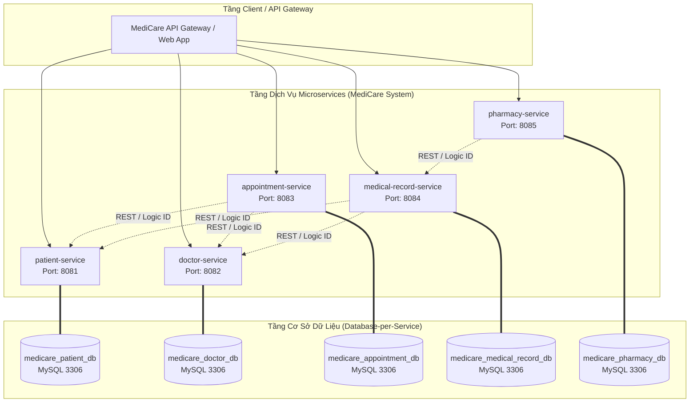

# MediCare Hospital Management System - SS4 Bài Tập 1: Phân Tích Chia Module Microservices & Thiết Kế Database-per-Service

Tài liệu báo cáo phân tích Bounded Context, sơ đồ kiến trúc tổng thể, thiết kế 5 CSDL MySQL riêng biệt (`Database-per-Service`), giải thích cơ chế tham chiếu ID liên dịch vụ và cấu hình 5 file `application.yml` cho Hệ thống Quản lý Bệnh viện Đa khoa **MediCare**.

---

## 1. Phân Tích Và Chia Module Microservices (Yêu Cầu 1)

### 1.1 Sơ Đồ Kiến Trúc Tổng Thể MediCare System



---

### 1.2 Lý Do Phân Tách 5 Microservices Theo Bounded Context (DDD)

1. **Patient Service (`patient-service` - Port 8081)**:
   - *Lý do phân tách*: Đóng gói toàn bộ nghiệp vụ quản lý thông tin hành chính, số BHYT, địa chỉ và thông tin nhân thân bệnh nhân. Việc tách riêng service giúp hệ thống độc lập xử lý tần suất truy xuất dữ liệu bệnh nhân lớn lúc tiếp đón mà không gây ảnh hưởng đến hệ thống khám lâm sàng hay kho dược.
2. **Doctor Service (`doctor-service` - Port 8082)**:
   - *Lý do phân tách*: Đóng gói nghiệp vụ quản lý danh mục bác sĩ, trình độ chuyên khoa và lịch trình làm việc/ca trực. Phân tách giúp phòng Quản lý Nhân sự & Phòng khám chủ động điều chỉnh ca trực bác sĩ độc lập mà không bị ràng buộc bởi logic đặt lịch hay đơn thuốc.
3. **Appointment Service (`appointment-service` - Port 8083)**:
   - *Lý do phân tách*: Đóng gói toàn bộ quy trình đặt lịch hẹn khám bệnh trực tuyến/tại quầy và quản lý vòng đời trạng thái lịch khám (`PENDING`, `CONFIRMED`, `COMPLETED`, `CANCELLED`). Service này chịu tải biến động rất cao vào giờ cao điểm khi bệnh nhân đồng loạt đặt lịch, tách riêng giúp dễ dàng auto-scaling độc lập.
4. **Medical Record Service (`medical-record-service` - Port 8084)**:
   - *Lý do phân tách*: Đóng gói nghiệp vụ lưu trữ hồ sơ bệnh án, kết quả chẩn đoán y khoa và chi tiết đơn thuốc sau khám. Dữ liệu bệnh án có tính chất bảo mật cao (HIPAA/Chuẩn y tế) và dung lượng lưu trữ lớn, tách biệt giúp tối ưu hóa bảo mật và phục vụ tra cứu lịch sử bệnh lý lâu dài.
5. **Pharmacy Service (`pharmacy-service` - Port 8085)**:
   - *Lý do phân tách*: Đóng gói nghiệp vụ quản lý danh mục thuốc, nhập/xuất kho dược, kiểm soát tồn kho và cấp phát thuốc theo đơn. Giúp dược sĩ và kho dược quản lý chính xác tồn kho thuốc tức thì mà không phụ thuộc vào tiến trình đặt khám hay quản lý bác sĩ.

---

### 1.3 Bảng Phân Định Port Và Database Của 5 Services

| Microservice | Port | Tên Cơ Sở Dữ Liệu MySQL | Thực Thể Chính |
| :--- | :--- | :--- | :--- |
| `patient-service` | `8081` | `medicare_patient_db` | `patients` |
| `doctor-service` | `8082` | `medicare_doctor_db` | `doctors` |
| `appointment-service` | `8083` | `medicare_appointment_db` | `appointments` |
| `medical-record-service` | `8084` | `medicare_medical_record_db` | `medical_records` |
| `pharmacy-service` | `8085` | `medicare_pharmacy_db` | `medicines` |

---

## 2. Thiết Kế Cơ Sở Dữ Liệu Cho Từng Service (Yêu Cầu 2)

Mỗi Microservice sở hữu **MỘT cơ sở dữ liệu MySQL độc lập** tuân thủ nguyên tắc `Database-per-Service`.

### 2.1 Patient Service — Database: `medicare_patient_db`

```sql
CREATE DATABASE IF NOT EXISTS medicare_patient_db;
USE medicare_patient_db;

CREATE TABLE patients (
    id            BIGINT AUTO_INCREMENT PRIMARY KEY,
    full_name     VARCHAR(100) NOT NULL,
    date_of_birth DATE NOT NULL,
    gender        ENUM('MALE', 'FEMALE', 'OTHER') NOT NULL,
    phone         VARCHAR(15),
    address       VARCHAR(255),
    insurance_id  VARCHAR(20),
    created_at    DATETIME DEFAULT CURRENT_TIMESTAMP,
    updated_at    DATETIME DEFAULT CURRENT_TIMESTAMP ON UPDATE CURRENT_TIMESTAMP
);
```

---

### 2.2 Doctor Service — Database: `medicare_doctor_db`

```sql
CREATE DATABASE IF NOT EXISTS medicare_doctor_db;
USE medicare_doctor_db;

CREATE TABLE doctors (
    id            BIGINT AUTO_INCREMENT PRIMARY KEY,
    full_name     VARCHAR(100) NOT NULL,
    specialty     VARCHAR(100) NOT NULL,
    phone         VARCHAR(15),
    email         VARCHAR(100),
    schedule_info TEXT,
    created_at    DATETIME DEFAULT CURRENT_TIMESTAMP,
    updated_at    DATETIME DEFAULT CURRENT_TIMESTAMP ON UPDATE CURRENT_TIMESTAMP
);
```

---

### 2.3 Appointment Service — Database: `medicare_appointment_db`

```sql
CREATE DATABASE IF NOT EXISTS medicare_appointment_db;
USE medicare_appointment_db;

CREATE TABLE appointments (
    id               BIGINT AUTO_INCREMENT PRIMARY KEY,
    patient_id       BIGINT NOT NULL,  -- Tham chiếu logic ID sang medicare_patient_db.patients(id)
    doctor_id        BIGINT NOT NULL,  -- Tham chiếu logic ID sang medicare_doctor_db.doctors(id)
    appointment_time DATETIME NOT NULL,
    status           ENUM('PENDING', 'CONFIRMED', 'COMPLETED', 'CANCELLED') DEFAULT 'PENDING',
    reason           VARCHAR(255),
    created_at       DATETIME DEFAULT CURRENT_TIMESTAMP,
    updated_at       DATETIME DEFAULT CURRENT_TIMESTAMP ON UPDATE CURRENT_TIMESTAMP
);
```

---

### 2.4 Medical Record Service — Database: `medicare_medical_record_db`

```sql
CREATE DATABASE IF NOT EXISTS medicare_medical_record_db;
USE medicare_medical_record_db;

CREATE TABLE medical_records (
    id                   BIGINT AUTO_INCREMENT PRIMARY KEY,
    patient_id           BIGINT NOT NULL,  -- Tham chiếu logic ID sang medicare_patient_db
    doctor_id            BIGINT NOT NULL,  -- Tham chiếu logic ID sang medicare_doctor_db
    appointment_id       BIGINT,           -- Tham chiếu logic ID sang medicare_appointment_db
    diagnosis            TEXT,
    treatment_plan       TEXT,
    prescription_details TEXT,             -- Chi tiết đơn thuốc
    created_at           DATETIME DEFAULT CURRENT_TIMESTAMP,
    updated_at           DATETIME DEFAULT CURRENT_TIMESTAMP ON UPDATE CURRENT_TIMESTAMP
);
```

---

### 2.5 Pharmacy Service — Database: `medicare_pharmacy_db`

```sql
CREATE DATABASE IF NOT EXISTS medicare_pharmacy_db;
USE medicare_pharmacy_db;

CREATE TABLE medicines (
    id                BIGINT AUTO_INCREMENT PRIMARY KEY,
    name              VARCHAR(100) NOT NULL,
    active_ingredient VARCHAR(100),
    unit              VARCHAR(50),
    stock_quantity    INT NOT NULL DEFAULT 0,
    unit_price        DECIMAL(12,2) NOT NULL DEFAULT 0.00,
    created_at        DATETIME DEFAULT CURRENT_TIMESTAMP,
    updated_at        DATETIME DEFAULT CURRENT_TIMESTAMP ON UPDATE CURRENT_TIMESTAMP
);
```

---

### 2.6 Giải Thích Cách Xử Lý Liên Kết Dữ Liệu Liên Dịch Vụ (Cross-Service Data Linking)

1. **Vì sao KHÔNG dùng SQL JOIN cross-database hay khóa ngoại RDBMS (FOREIGN KEY)?**:
   - Khi tách thành Microservices, mỗi CSDL nằm trên máy chủ/cluster MySQL riêng biệt. Việc dùng `FOREIGN KEY` hay SQL `JOIN` cross-database bị nghiêm cấm vì tạo ra sự phụ thuộc cứng (Tight Coupling) ở tầng dữ liệu, khiến các service không thể scale hay thay đổi schema độc lập.
2. **Cơ chế lưu ID Tham chiếu Logic (Logical ID Reference)**:
   - Trong `appointments` table (`medicare_appointment_db`), các cột `patient_id` và `doctor_id` chỉ được lưu dưới dạng số nguyên `BIGINT` đơn thuần (kiểu Primitive Long ID).
   - `appointment-service` **KHÔNG tạo `@ManyToOne` hay `@JoinColumn`** tới lớp `Patient` hay `Doctor`.
3. **Cách lấy dữ liệu tổng hợp (API Aggregation Pattern)**:
   - Khi màn hình hiển thị danh sách lịch khám cần tên bệnh nhân và tên bác sĩ, `appointment-service` sẽ gọi API REST (hoặc OpenFeign/CompletableFuture) sang `patient-service` (`GET /api/v1/patients/{patientId}`) và `doctor-service` (`GET /api/v1/doctors/{doctorId}`) để ghép thông tin hiển thị cho phía Client.

---

## 3. Mã Nguồn 5 File `application.yml` Cho 5 Services (Yêu Cầu 3)

### 3.1 `patient-service/src/main/resources/application.yml`
```yaml
server:
  port: 8081

spring:
  application:
    name: patient-service

  datasource:
    url: jdbc:mysql://localhost:3306/medicare_patient_db?createDatabaseIfNotExist=true&useSSL=false&allowPublicKeyRetrieval=true
    username: root
    password: root
    driver-class-name: com.mysql.cj.jdbc.Driver

  jpa:
    hibernate:
      ddl-auto: update
    show-sql: true
    properties:
      hibernate:
        dialect: org.hibernate.dialect.MySQLDialect
```

### 3.2 `doctor-service/src/main/resources/application.yml`
```yaml
server:
  port: 8082

spring:
  application:
    name: doctor-service

  datasource:
    url: jdbc:mysql://localhost:3306/medicare_doctor_db?createDatabaseIfNotExist=true&useSSL=false&allowPublicKeyRetrieval=true
    username: root
    password: root
    driver-class-name: com.mysql.cj.jdbc.Driver

  jpa:
    hibernate:
      ddl-auto: update
    show-sql: true
    properties:
      hibernate:
        dialect: org.hibernate.dialect.MySQLDialect
```

### 3.3 `appointment-service/src/main/resources/application.yml`
```yaml
server:
  port: 8083

spring:
  application:
    name: appointment-service

  datasource:
    url: jdbc:mysql://localhost:3306/medicare_appointment_db?createDatabaseIfNotExist=true&useSSL=false&allowPublicKeyRetrieval=true
    username: root
    password: root
    driver-class-name: com.mysql.cj.jdbc.Driver

  jpa:
    hibernate:
      ddl-auto: update
    show-sql: true
    properties:
      hibernate:
        dialect: org.hibernate.dialect.MySQLDialect
```

### 3.4 `medical-record-service/src/main/resources/application.yml`
```yaml
server:
  port: 8084

spring:
  application:
    name: medical-record-service

  datasource:
    url: jdbc:mysql://localhost:3306/medicare_medical_record_db?createDatabaseIfNotExist=true&useSSL=false&allowPublicKeyRetrieval=true
    username: root
    password: root
    driver-class-name: com.mysql.cj.jdbc.Driver

  jpa:
    hibernate:
      ddl-auto: update
    show-sql: true
    properties:
      hibernate:
        dialect: org.hibernate.dialect.MySQLDialect
```

### 3.5 `pharmacy-service/src/main/resources/application.yml`
```yaml
server:
  port: 8085

spring:
  application:
    name: pharmacy-service

  datasource:
    url: jdbc:mysql://localhost:3306/medicare_pharmacy_db?createDatabaseIfNotExist=true&useSSL=false&allowPublicKeyRetrieval=true
    username: root
    password: root
    driver-class-name: com.mysql.cj.jdbc.Driver

  jpa:
    hibernate:
      ddl-auto: update
    show-sql: true
    properties:
      hibernate:
        dialect: org.hibernate.dialect.MySQLDialect
```

---

## 4. Cấu Trúc Thư Mục Dự Án (`d:\microservice\BaiTap\SS4\BaiTap1`)

```text
d:\microservice\BaiTap\SS4\BaiTap1
├── README.md
├── docs
│   └── erd_diagrams.md
├── patient-service
│   ├── build.gradle
│   ├── settings.gradle
│   └── src/main
│       ├── java/com/medicare/patient/
│       │   ├── PatientServiceApplication.java
│       │   ├── controller/PatientController.java
│       │   ├── model/Patient.java
│       │   └── repository/PatientRepository.java
│       └── resources/application.yml
├── doctor-service
│   ├── build.gradle
│   ├── settings.gradle
│   └── src/main
│       ├── java/com/medicare/doctor/
│       │   ├── DoctorServiceApplication.java
│       │   ├── controller/DoctorController.java
│       │   ├── model/Doctor.java
│       │   └── repository/DoctorRepository.java
│       └── resources/application.yml
├── appointment-service
│   ├── build.gradle
│   ├── settings.gradle
│   └── src/main
│       ├── java/com/medicare/appointment/
│       │   ├── AppointmentServiceApplication.java
│       │   ├── controller/AppointmentController.java
│       │   ├── model/Appointment.java, AppointmentStatus.java
│       │   └── repository/AppointmentRepository.java
│       └── resources/application.yml
├── medical-record-service
│   ├── build.gradle
│   ├── settings.gradle
│   └── src/main
│       ├── java/com/medicare/medicalrecord/
│       │   ├── MedicalRecordServiceApplication.java
│       │   ├── controller/MedicalRecordController.java
│       │   ├── model/MedicalRecord.java
│       │   └── repository/MedicalRecordRepository.java
│       └── resources/application.yml
└── pharmacy-service
    ├── build.gradle
    ├── settings.gradle
    └── src/main
        ├── java/com/medicare/pharmacy/
        │   ├── PharmacyServiceApplication.java
        │   ├── controller/PharmacyController.java
        │   ├── model/Medicine.java
        │   └── repository/MedicineRepository.java
        └── resources/application.yml
```
