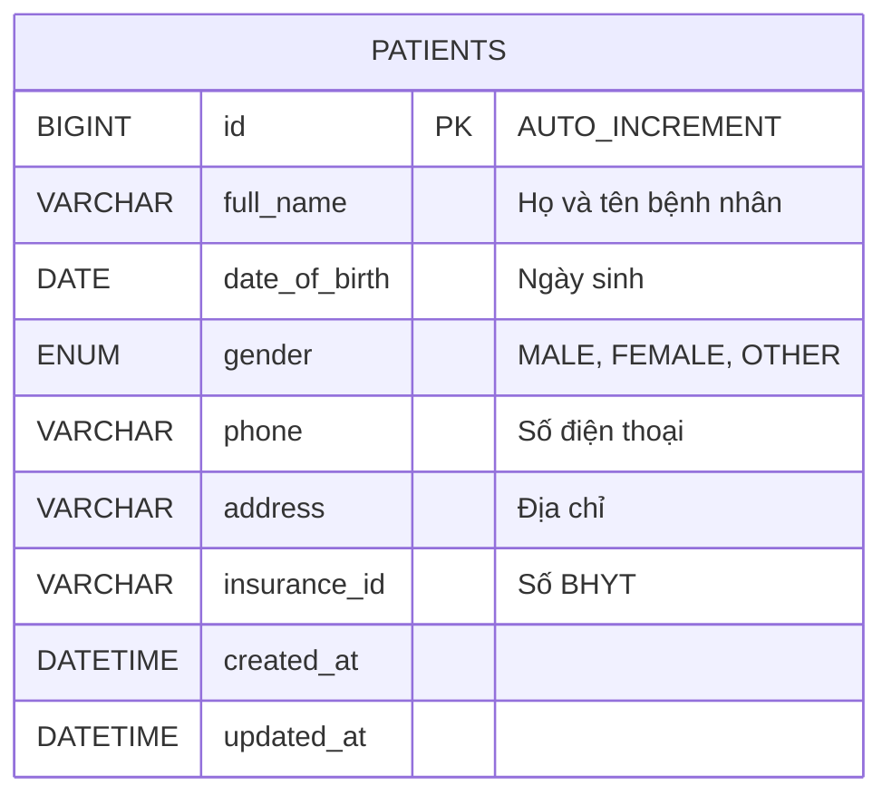
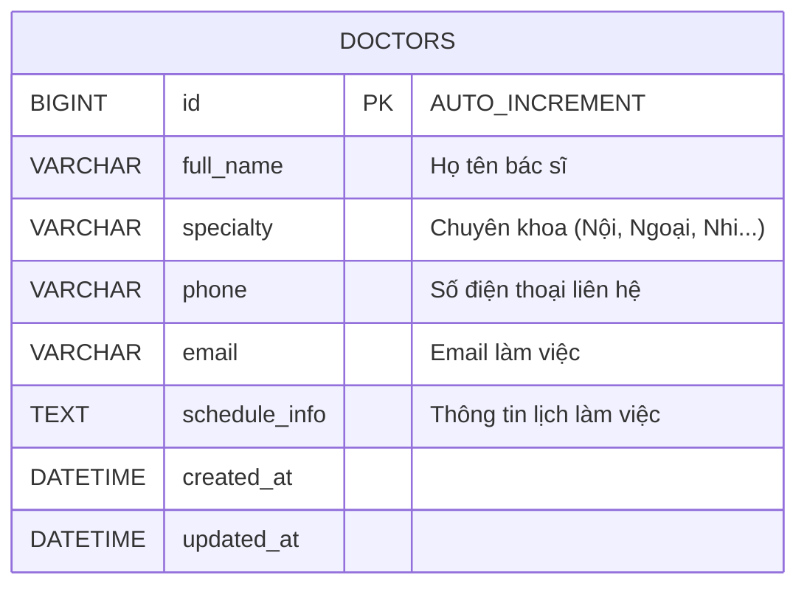
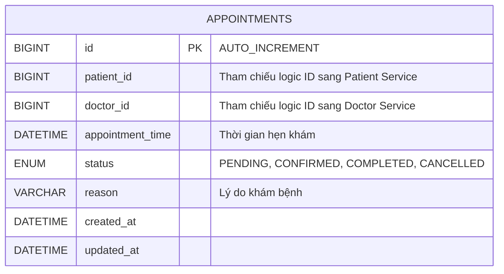
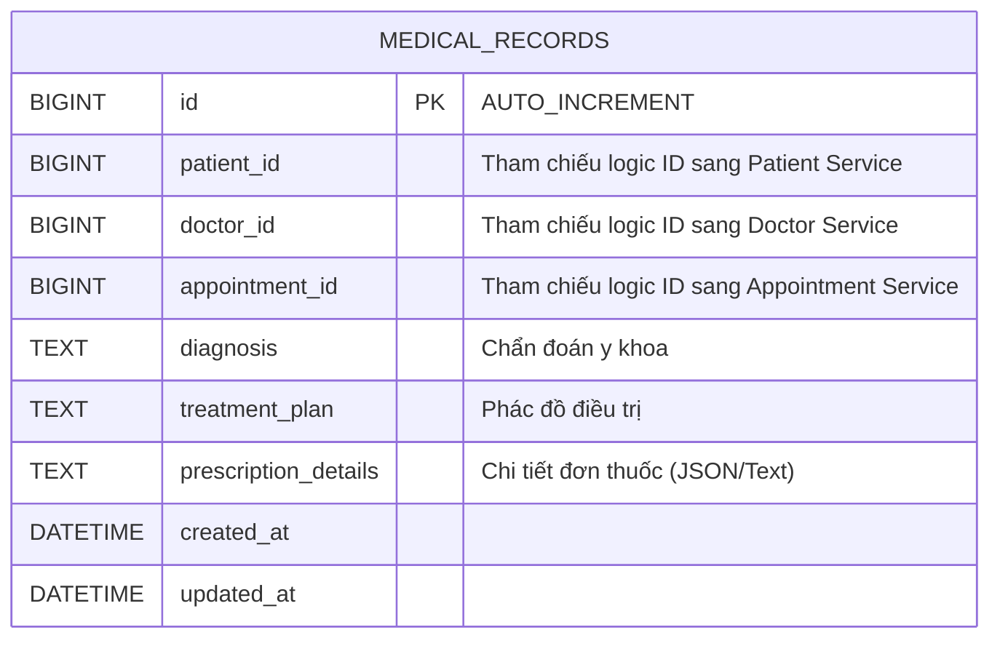
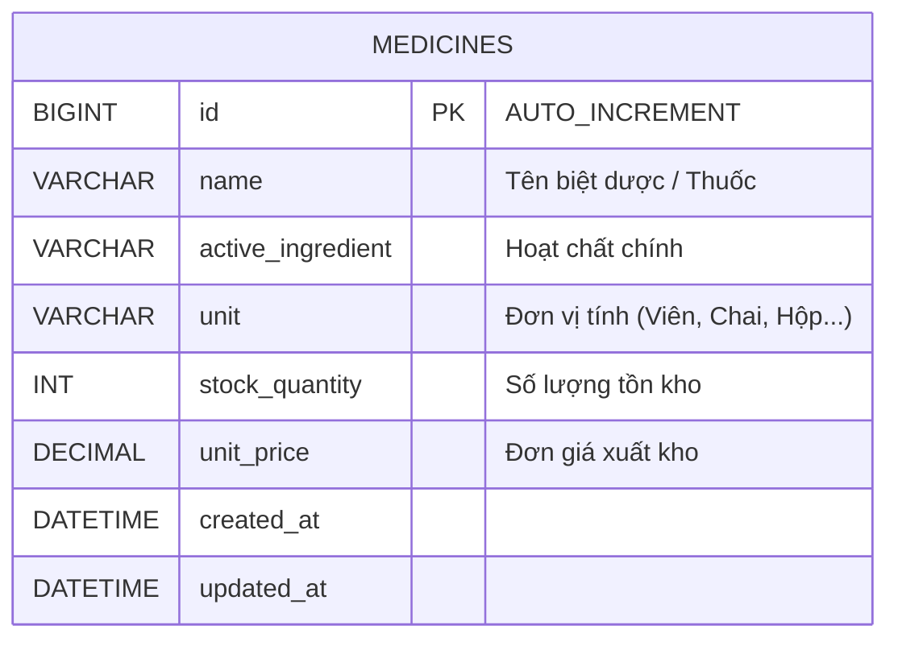

# MediCare Hospital Microservices System - Entity Relationship Diagrams (ERD)

Tài liệu thiết kế sơ đồ ERD chi tiết cho 5 CSDL Microservices thuộc hệ thống Bệnh viện Đa khoa MediCare.

---

## 1. Patient Service ERD (`medicare_patient_db`)

---

## 2. Doctor Service ERD (`medicare_doctor_db`)

---

## 3. Appointment Service ERD (`medicare_appointment_db`)

---

## 4. Medical Record Service ERD (`medicare_medical_record_db`)

---

## 5. Pharmacy Service ERD (`medicare_pharmacy_db`)

