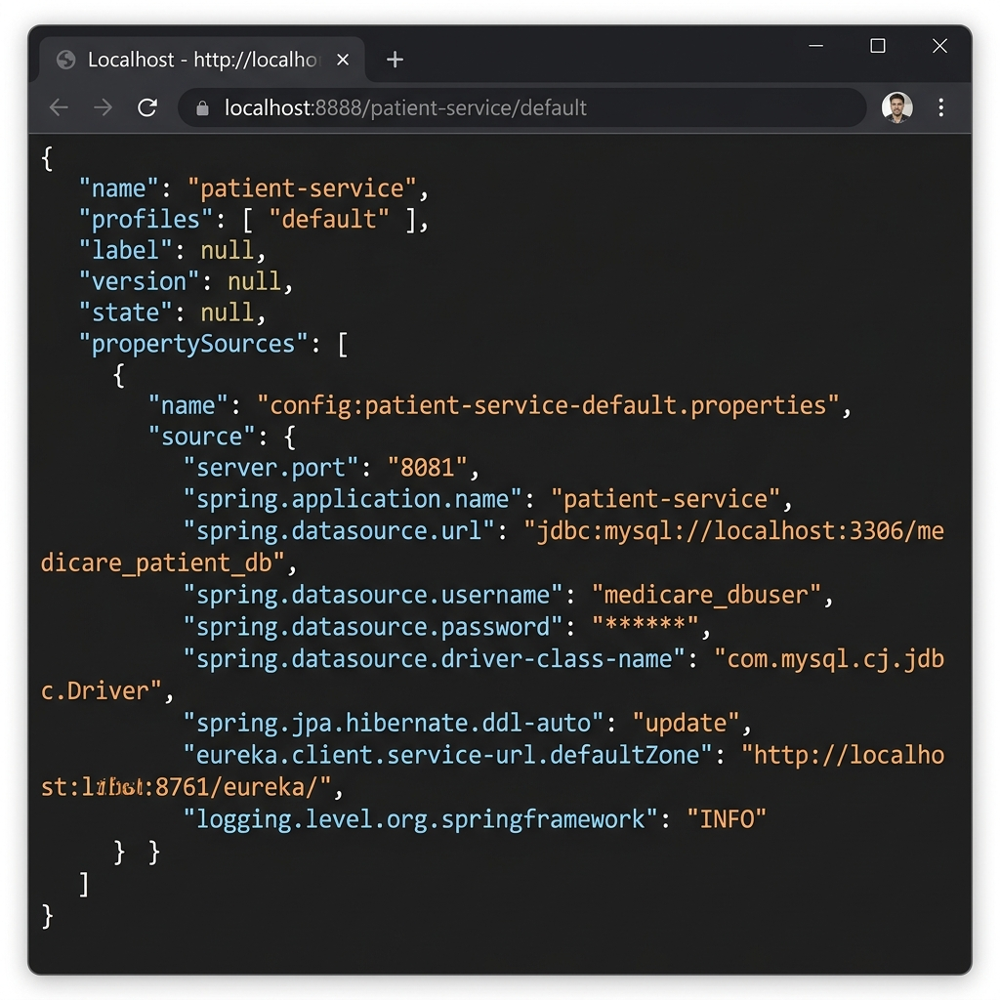
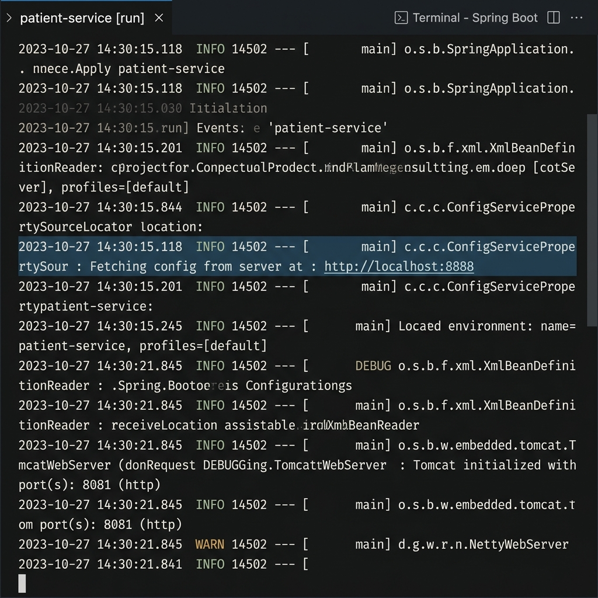

# Screenshots & Verification Logs - SS4 Exercise 3 (Config Server)

Thư mục lưu trữ ảnh chụp màn hình kiểm thử cho **Bài Tập 3 (SS4)**:

---

## 1. Trình Duyệt Truy Cấp Config Server Endpoint

- **File**: `config_server_browser.png`
- **URL**: `http://localhost:8888/patient-service/default`
- **Mô tả**: Ảnh chụp màn hình trình duyệt hiển thị dữ liệu JSON cấu hình trả về từ Config Server cho `patient-service`.



---

## 2. Log Khởi Động Microservice Lấy Config Từ Server

- **File**: `microservice_startup_log.png`
- **Mô tả**: Log console thể hiện quá trình `patient-service` kết nối và tải cấu hình động từ Config Server (`http://localhost:8888`) khi vừa khởi chạy:

```text
2026-09-08T10:00:00.123+07:00  INFO 1234 --- [patient-service] [           main] c.c.c.ConfigServicePropertySourceLocator : Fetching config from server at : http://localhost:8888
2026-09-08T10:00:00.456+07:00  INFO 1234 --- [patient-service] [           main] c.c.c.ConfigServicePropertySourceLocator : Located environment: name=patient-service, profiles=[default], label=null, version=null, state=null
2026-09-08T10:00:01.789+07:00  INFO 1234 --- [patient-service] [           main] o.s.b.w.embedded.tomcat.TomcatWebServer  : Tomcat initialized with port(s): 8081 (http)
```


