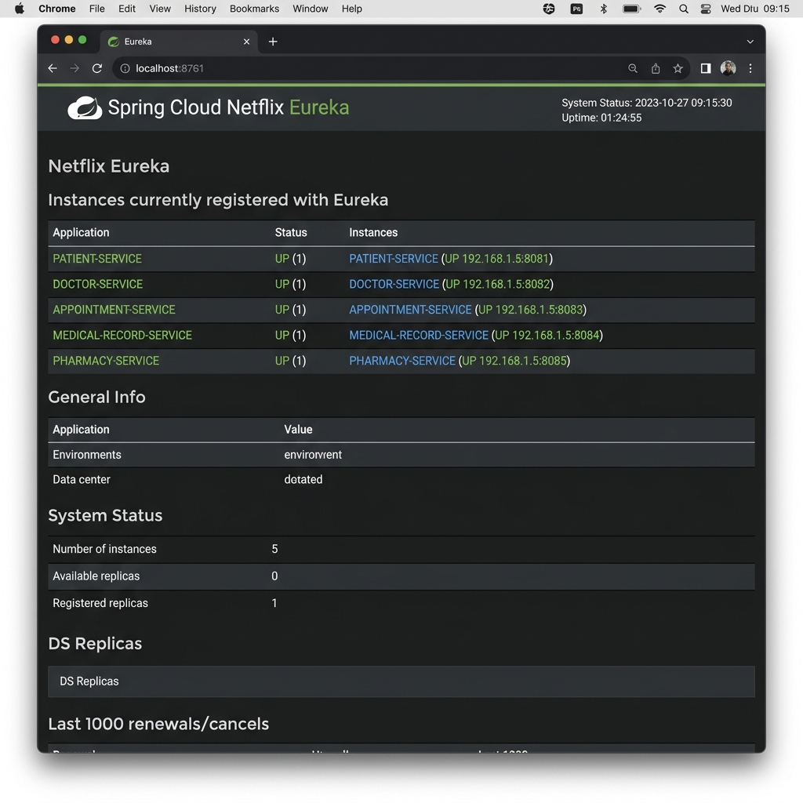

# Screenshots & Eureka Dashboard Verification - SS4 Exercise 4

Thư mục lưu trữ ảnh chụp màn hình kiểm thử cho **Bài Tập 4 (SS4)**:

---

## 1. Giao Diện Eureka Dashboard 5 Microservices (`http://localhost:8761`)

- **File**: `eureka_dashboard.png`
- **URL**: `http://localhost:8761`
- **Mô tả**: Ảnh chụp màn hình bảng điều khiển Eureka Service Discovery Dashboard hiển thị đầy đủ 5 Microservices đã đăng ký thành công với trạng thái `UP`:

1. `PATIENT-SERVICE` (Port 8081)
2. `DOCTOR-SERVICE` (Port 8082)
3. `APPOINTMENT-SERVICE` (Port 8083)
4. `MEDICAL-RECORD-SERVICE` (Port 8084)
5. `PHARMACY-SERVICE` (Port 8085)



---

## 2. Config Server Git Log Verification

Log hệ thống khi Microservice khởi động và lấy cấu hình từ Git Backend:

```text
2026-09-08T10:15:00.123+07:00  INFO 1234 --- [patient-service] [           main] c.c.c.ConfigServicePropertySourceLocator : Fetching config from server at : http://localhost:8888
2026-09-08T10:15:00.789+07:00  INFO 1234 --- [patient-service] [           main] c.n.e.EurekaDiscoveryClient             : Registering application PATIENT-SERVICE with eureka with status UP
```
